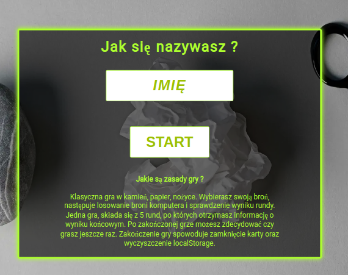
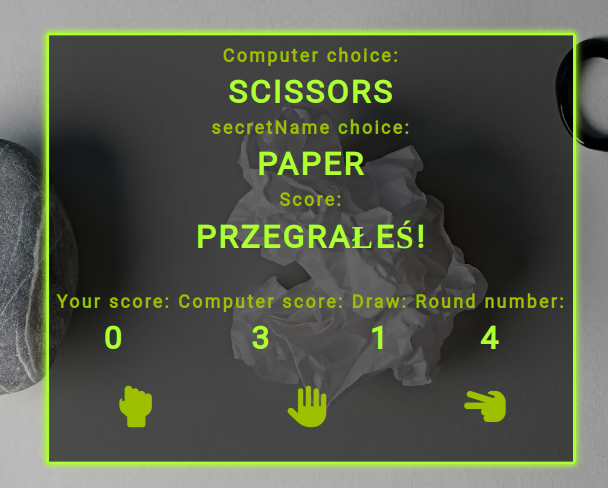
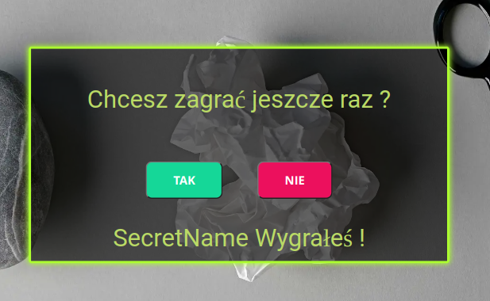

# 1. Rock Paper Scissors

## Classic game of stone, paper, scissors in javascript with pure CSS and use localStorage.

### How to play ?

- You choose your weapon, the computer's weapon is drawn and the round result is checked.
- One game consists of 5 rounds, after which you will be informed about the final result.
- After the game is over, you can decide whether to play again.
- Ending the game will close the tab and clear the localStorage.

## Check out demo

Check out demo page here: [https://popular-games.netlify.app](https://popular-games.netlify.app)

## What's I use ?

- Pure JavaScript

- Flexbox

- Pure CSS with variables & reset file from http://meyerweb.com/eric/tools/css/reset/
- @Font-face & icon from https://fonts.google.com
- IMG from free image stock

## In the future

- mobile version with RWD

## What does the game look like?

