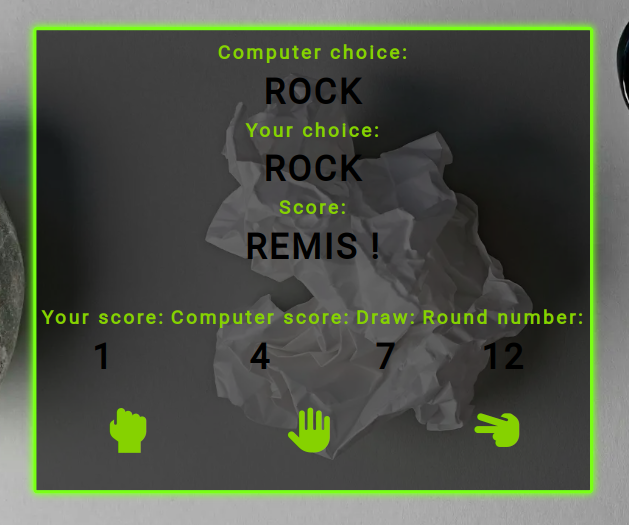

# 1. Rock Paper Scissors

Popular simple javascript games - "Rock, papaer, scissors".
You enter the develop branch! The game is under construction.

## How to play ?

Check out demo page here: [demo](https://popular-games.netlify.app)

## What's I use ?

- Pure JavaScript

- Flexbox

- Pure CSS with variables & reset file from http://meyerweb.com/eric/tools/css/reset/
- @Font-face & icon from https://fonts.google.com
- IMG from free image stock

## In the future

- mobile version with RWD
- write data to Local Storage

## In progress

- write data to Local Storage
